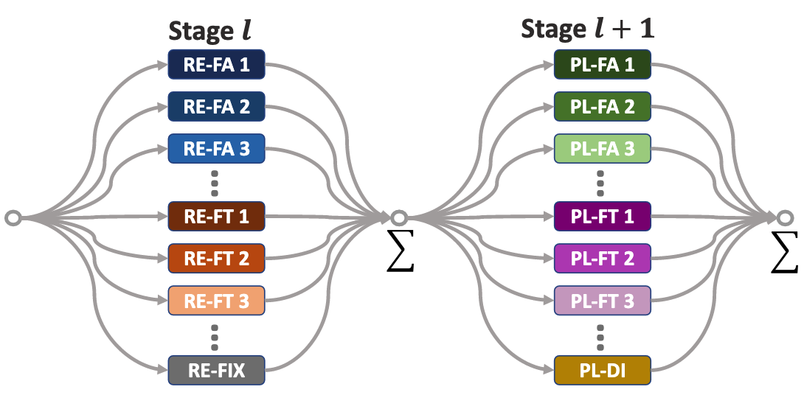
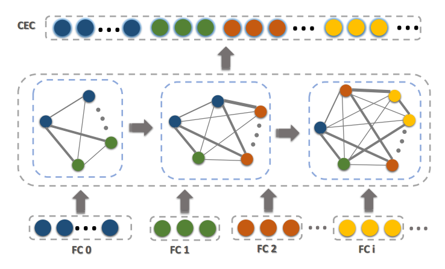
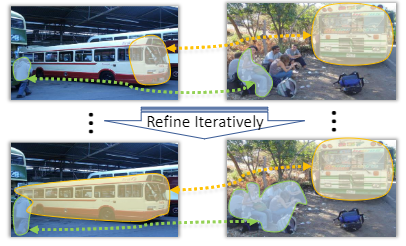
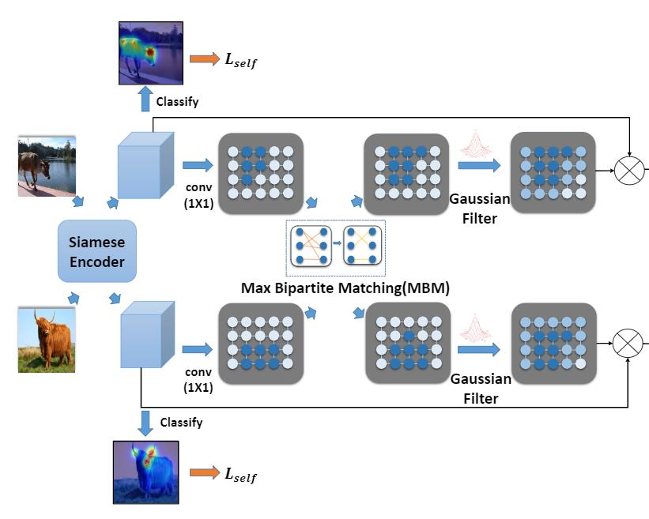
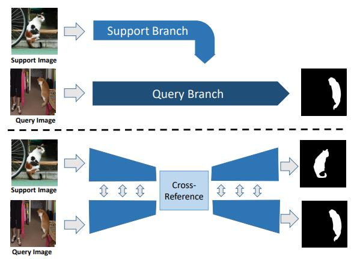
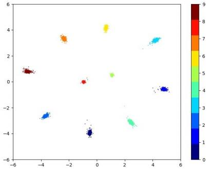

## About Me
I am currently a Scientist at at Institute for Infocomm Research (I2R), Agency for Science, Technology and Research (ASTAR), Singapore. Previously, I obtained my Bachelor’s Degree from University of Electronic Science and Technology of China (UESTC) at 2014. After that, I finished my Master degree and Ph.D degree from Nanyang Technological University (NTU), Singapore at 2016 and 2020, respectively, under the supervision of Prof. Wang Jianliang, Prof. Wen Changyun and Prof. Lin Guosheng. I also cooperated with Prof. Yuan Junsong.

## Research Interests
My research interests include computer vision, machine learning and time series analysis. The specific topics which I previously researched on are listed below:
- **Computer Vision:** video object detection, object detection, point cloud
- **Machine Learning:** weakly supervised learing, knowledge distillation
- **Time Series Analysis:** machine remaining useful life prediciton, fault diagnosis

## News
- **[Aug. 2022]** One paper is accepted to *IEEE/CAA Journal of Automatica Sinica*.
- **[Apr. 2022]** One paper is accepted to *IEEE Transactions on Instrumentation and Measurement*.
- **[Feb. 2022]** One paper is accepted to *Knowledge-Based Systems*
- **[Feb. 2022]** One paper is accepted to *Pattern Recognition*
- **[Jun. 2021]** Our team *AStarTrek* achieved the **1st place winner** for [the CVPR 2021 UG2+ Challenge Track 2.1](http://cvpr2022.ug2challenge.org/program21/leaderboard21_t2.html).
- **[Jun. 2021]** One paper is accepted to *Journal of Biophotonics*.
- **[Apr. 2021]** One paper is accepted to *Biomedical Optics Express*.
- **[Oct. 2020]** One paper is accepted to *IEEE Signal Processing Letters*.

## Selected Publications
[comment]: <> (iccv2021.)

  

<strong>Meta Navigator: Search for a Good Adaptation Policy for Few-shot Learning</strong>
 
<strong>Chi Zhang</strong>, Henghui Ding, Guosheng Lin, Ruibo Li, Changhu Wang, Chunhua Shen
 
<em>IEEE International Conference on Computer Vision. <strong><i style="color:#1e90ff">ICCV 2021</i></strong>.</em>
  
   [<a href="https://openaccess.thecvf.com/content/ICCV2021/papers/Zhang_Meta_Navigator_Search_for_a_Good_Adaptation_Policy_for_Few-Shot_ICCV_2021_paper.pdf">PDF</a>]
 

[comment]: <> (fscil.)

  

<strong>Few-Shot Incremental Learning with Continually Evolved Classifiers</strong>
 
<strong>Chi Zhang</strong>,  Nan Song, Guosheng Lin, Yun Zheng, Pan Pan, Yinghui Xu
 
<em>IEEE Conference on Computer Vision and Pattern Recognition. <strong><i style="color:#1e90ff">CVPR 2021</i></strong>.</em>
  
  [<a href="https://arxiv.org/abs/2104.03047">PDF</a>][<a href="https://github.com/icoz69/CEC-CVPR2021">Code</a>]

  

[comment]: <> (DEEPEMD.)

  

<strong>DeepEMD: Few-Shot Image Classification with Differentiable Earth Mover's Distance and Structured Classifiers</strong>
 
<strong>Chi Zhang</strong>,  Yujun Cai, Guosheng Lin, Chunhua Shen
 
<em>IEEE Conference on Computer Vision and Pattern Recognition. <strong><i style="color:#1e90ff">CVPR 2020</i></strong>.</em>
  
[<a href="https://openaccess.thecvf.com/content_CVPR_2020/papers/Zhang_DeepEMD_Few-Shot_Image_Classification_With_Differentiable_Earth_Movers_Distance_and_CVPR_2020_paper.pdf">PDF</a>] [<a href="https://git.io/DeepEMD">Code</a>]<strong><i style="color:#e74d3c">Oral Presentation</i></strong>

[comment]: <> (pgnet.)

  

<strong>Pyramid Graph Networks with Connection Attentions for Region-Based One-Shot Semantic Segmentation</strong>
 
<strong>Chi Zhang</strong>, Guosheng Lin, Fayao Liu, Jiushuang Guo, Qingyao Wu, Rui Yao
 
<em>IEEE International Conference on Computer Vision. <strong><i style="color:#1e90ff">ICCV 2019</i></strong>.</em>
  
[<a href="https://openaccess.thecvf.com/content_ICCV_2019/papers/Zhang_Pyramid_Graph_Networks_With_Connection_Attentions_for_Region-Based_One-Shot_Semantic_ICCV_2019_paper.pdf">PDF</a>]

[comment]: <> (CANET.)

  

<strong>CANet: Class-Agnostic Segmentation Networks with Iterative Refinement and Attentive Few-Shot Learning</strong>
 
<strong>Chi Zhang</strong>, Guosheng Lin, Fayao Liu, Rui Yao, Chunhua Shen
 
<em>IEEE Conference on Computer Vision and Pattern Recognition. <strong><i style="color:#1e90ff">CVPR 2019</i></strong>.</em>
  
[<a href="https://openaccess.thecvf.com/content_CVPR_2019/papers/Zhang_CANet_Class-Agnostic_Segmentation_Networks_With_Iterative_Refinement_and_Attentive_Few-Shot_CVPR_2019_paper.pdf">PDF</a>] [<a href="https://github.com/icoz69/CaNet">Code</a>]

[comment]: <> (tip.)

  

<strong>CycleSegNet: Object Co-segmentation with Cycle Refinement and Region Correspondence</strong>
 
<strong>Chi Zhang</strong>, Guankai Li, Guosheng Lin, Qingyao Wu, Rui Yao
 
<em>IEEE Transactions on Image Processing. <strong><i style="color:#1e90ff">TIP</i></strong>.</em>
  
[<a href="https://arxiv.org/abs/2101.01308">PDF</a>] 

[comment]: <> (acm2020.)

  

<strong>Weakly Supervised Segmentation with Maximum Bipartite Graph Matching</strong>
 
 Weide Liu*, <strong>Chi Zhang*</strong>, Guosheng Lin, Tzu-Yi HUNG, Chunyan Miao     
   &emsp;&emsp;&emsp;&emsp;(* indicates equal contributions )
 

<em>Proceedings of ACM International Conference on Multimedia. 
  <strong><i style="color:#1e90ff"> ACM MM 2020</i></strong>.</em>
  
  [<a href="https://dl.acm.org/doi/10.1145/3394171.3413652">PDF</a>]

  

[comment]: <> (crnet.)

  

<strong>CRNet: Cross-Reference Networks for Few-Shot Segmentation</strong>
 
 Weide Liu, <strong>Chi Zhang</strong>, Guosheng Lin, Fayao Liu
 
<em>IEEE Conference on Computer Vision and Pattern Recognition. <strong><i style="color:#1e90ff">CVPR 2020</i></strong>.</em>
  
  [<a href="http://openaccess.thecvf.com/content_CVPR_2020/papers/Liu_CRNet_Cross-Reference_Networks_for_Few-Shot_Segmentation_CVPR_2020_paper.pdf">PDF</a>]

  

[comment]: <> (cgdl.)

  

<strong>Conditional Gaussian Distribution Learning for Open Set Recognition</strong>
 
  Xin Sun, Zhenning Yang,<strong>Chi Zhang</strong>, Guohao Peng, Keck-Voon Ling
 
<em>IEEE Conference on Computer Vision and Pattern Recognition. <strong><i style="color:#1e90ff">CVPR 2020</i></strong>.</em>
  
  [<a href="https://openaccess.thecvf.com/content_CVPR_2020/papers/Sun_Conditional_Gaussian_Distribution_Learning_for_Open_Set_Recognition_CVPR_2020_paper.pdf">PDF</a>] [<a href="https://github.com/mattolson93/CGDL-for-Open-Set-Recognition">Code</a>]

  

<!---

comment

-->
 
 
 

