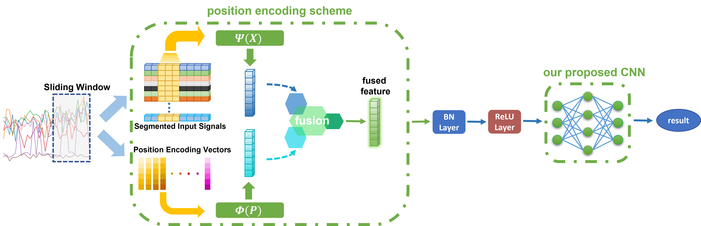
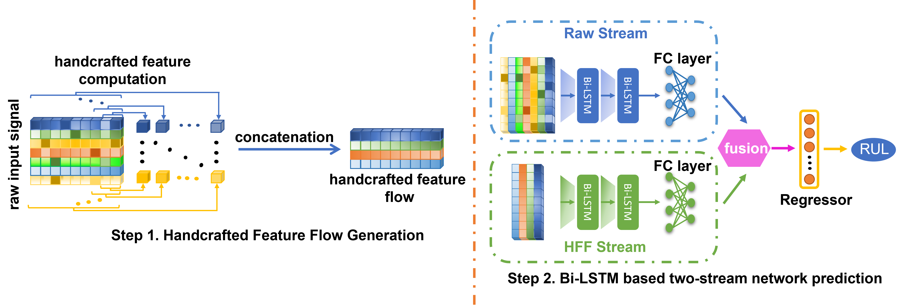
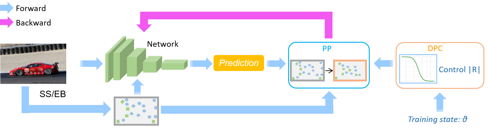
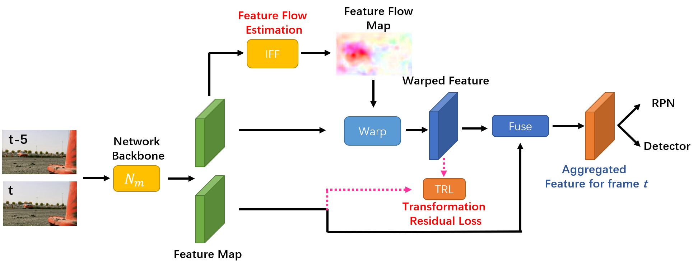

## About Me
I am currently a Scientist at at Institute for Infocomm Research (I2R), Agency for Science, Technology and Research (ASTAR), Singapore. Previously, I obtained my Bachelor’s Degree from University of Electronic Science and Technology of China (UESTC) at 2014. After that, I finished my Master degree and Ph.D degree from Nanyang Technological University (NTU), Singapore at 2016 and 2020, respectively, under the supervision of Prof. Wang Jianliang, Prof. Wen Changyun and Prof. Lin Guosheng. I also cooperated with Prof. Yuan Junsong.

## Research Interests
My research interests include computer vision, machine learning and time series analysis. The specific topics which I previously researched on are listed below:
- **Computer Vision:** video object detection, object detection, point cloud
- **Machine Learning:** weakly supervised learing, knowledge distillation
- **Time Series Analysis:** machine remaining useful life prediciton, fault diagnosis

## News
- **[Aug. 2022]** One paper is accepted to *IEEE/CAA Journal of Automatica Sinica*.
- **[Apr. 2022]** One paper is accepted to *IEEE Transactions on Instrumentation and Measurement*.
- **[Feb. 2022]** One paper is accepted to *Knowledge-Based Systems*
- **[Feb. 2022]** One paper is accepted to *Pattern Recognition*
- **[Jun. 2021]** Our team *AStarTrek* achieved the **1st place winner** for [the CVPR 2021 UG2+ Challenge Track 2.1](http://cvpr2022.ug2challenge.org/program21/leaderboard21_t2.html).
- **[Jun. 2021]** One paper is accepted to *Journal of Biophotonics*.
- **[Apr. 2021]** One paper is accepted to *Biomedical Optics Express*.
- **[Oct. 2020]** One paper is accepted to *IEEE Signal Processing Letters*.

## Selected Publications
[comment]: <>

  

<strong>Position Encoding Based Convolutional Neural Networks for Machine Remaining Useful Life Prediction</strong>
 
<strong>Jin Ruibing</strong>, Wu Min, Wu Keyu, Gao Kaizhou, Chen Zhenghua, Li Xiaoli
 
<em>IEEE/CAA Journal of Automatica Sinica. <strong><i style="color:#1e90ff">JAS</i></strong>.</em>

[comment]: <>

  

<strong>Bi-LSTM-Based Two-Stream Network for Machine Remaining Useful Life Prediction</strong>
 
<strong>Ruibing Jin</strong>, Zhenghua Chen, Keyu Wu, Min Wu, Xiaoli Li, Ruqiang Yan
 
<em>IEEE Transactions on Instrumentation and Measurement. <strong><i style="color:#1e90ff">TIM</i></strong>.</em>

[comment]: <>

  

<strong>Online Active Proposal Set Generation for Weakly Supervised Object Detection</strong>
 
<strong>Ruibing Jin</strong>, Guosheng Lin, Changyun Wen
 
<em>Knowledge-Based Systems. <strong><i style="color:#1e90ff">KBS</i></strong>.</em>
  
  

[comment]: <>

  

<strong>Feature flow: In-network feature flow estimation for video object detection</strong>
 
<strong>Ruibing Jin</strong>, Guosheng Lin, Changyun Wen, Jianliang Wang, Fayao Liu
 
<em>Pattern Recognition. <strong><i style="color:#1e90ff">PR</i></strong>.</em>

