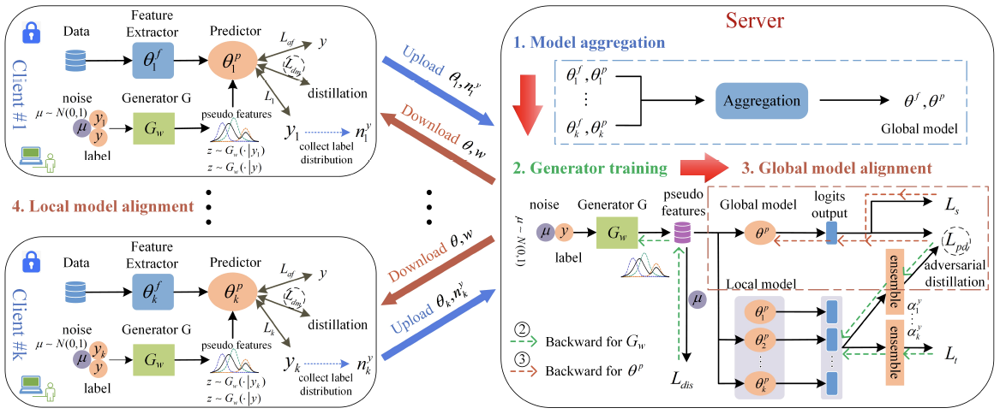
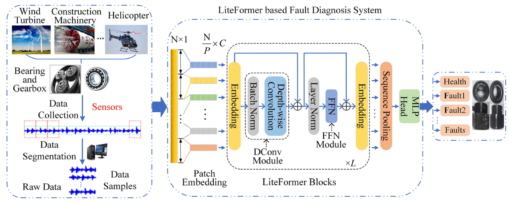
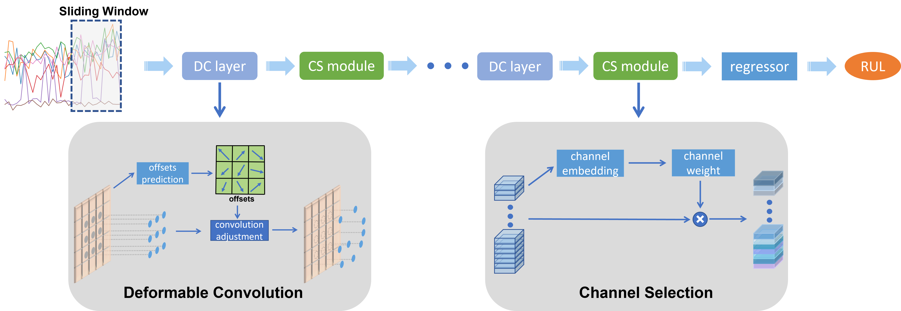

## About Me
I am currently a Scientist at Institute for Infocomm Research (I2R), Agency for Science, Technology and Research (ASTAR), Singapore. Previously, I obtained my Bachelor’s Degree from University of Electronic Science and Technology of China (UESTC). After that, I obtained my Master and Ph.D degree from Nanyang Technological University (NTU), Singapore, respectively, under the supervision of Prof. Wang Jianliang, Prof. Wen Changyun and Prof. Lin Guosheng. I also cooperated with Prof. Yuan Junsong.

## Research Interests
My research interests include computer vision, machine learning, time series and federated learning.

## Awards
- **A*STAR Research Highlights**, Agency for Science, Technology and Research[Link](https://research.a-star.edu.sg/articles/highlights/seamless-operations-with-machine-health-checks/)
- **Good Article Promotion**, IEEE/CAA Journal of Automatica Sinica (2024 IF: 15.3)[Link](https://mp.weixin.qq.com/s/Mua13qe4LJqt1AwZ2XHFYQ) 
- **Best Paper Award**, The 17th IEEE Conference on Industrial Electronics and Applications (2022)[Link](https://www.ieeeiciea.org/2022/)
- **1st Place Winner**, 4th CVPR UG2+ Challenge (10k USD prizes): Fully Supervised Action Recognition in the Dark (2021)[Link](http://cvpr2022.ug2challenge.org/program21/leaderboard21_t2.html)

## Services
I am a reviewer of top-tier conferences and journals including CVPR, ICCV, ECCV, TCSVT, TNNLS, TII, PR, etc.

## News
- **[Jun. 2024]** One paper is accepted by *IEEE Transactions on Industrial Informatics*.
- **[May. 2024]** One paper is accepted by *IEEE Transactions on Artificial Intelligence*.
- **[Feb. 2024]** Our [AdaNet](https://ieeexplore.ieee.org/abstract/document/10065450) published on TII is reported on [A*STAR Research Highlights](https://research.a-star.edu.sg/articles/highlights/seamless-operations-with-machine-health-checks/).
- **[Dec. 2023]** One paper is accepted by *IEEE Transactions on Instrumentation and Measurement*.
- **[Oct. 2023]** One paper is accepted by *IEEE Transactions on Neural Networks and Learning Systems*.
- **[Oct. 2023]** One paper is accepted by *IEEE Transactions on Reliability*.
- **[Mar. 2023]** One paper is accepted by *IEEE Transactions on Industrial Informatics*.
- **[Dec. 2022]** Our paper “Multi-task Self-Supervised Adaptation for Reinforcement Learning” has won **the best paper award** at The 17th IEEE Conference on Industrial Electronics and Applications 2022！
- **[Dec. 2022]** The source code for our [Bi-LSTM based Two-Stream Network for RUL](https://github.com/ruibing-jin/Bi_LSTM_TS) is released!
- **[Nov. 2022]** One paper is accepted by *IEEE Transactions on Circuits and Systems for Video Technology*.
- **[Oct. 2022]** 💥💥Our [PE-Net](https://ieeexplore.ieee.org/document/9849459) receives much attention and is reported by the [official JAS channel](https://mp.weixin.qq.com/s/Mua13qe4LJqt1AwZ2XHFYQ) and some famous media, such as [Tech Xplore](https://techxplore.com/news/2022-10-convolutional-neural-network-framework-life.amp), [EurekAlert!](https://www.eurekalert.org/news-releases/968147), and [PR Newswire](https://www.prnewswire.com/news-releases/new-study-in-ieeecaa-journal-of-automatica-sinica-describes-convolutional-neural-network-framework-to-predict-remaining-useful-life-in-machines-301654980.html).
- **[Oct. 2022]** The source code for our [PE-Net](https://github.com/ruibing-jin/PE-Net) is released!
- **[Aug. 2022]** One paper is accepted by *IEEE/CAA Journal of Automatica Sinica*.
- **[Apr. 2022]** One paper is accepted by *IEEE Transactions on Instrumentation and Measurement*.
- **[Feb. 2022]** One paper is accepted by *Knowledge-Based Systems*
- **[Feb. 2022]** One paper is accepted by *Pattern Recognition*
- **[Jun. 2021]** Our team *AStarTrek* achieved the **1st place winner** for [the CVPR 2021 UG2+ Challenge Track 2.1](http://cvpr2022.ug2challenge.org/program21/leaderboard21_t2.html), which is officially repored by ASTAR on [LinkedIn](https://www.linkedin.com/feed/update/urn:li:activity:6805305218507657216/).
- **[Jun. 2021]** One paper is accepted by *Journal of Biophotonics*.
- **[Apr. 2021]** One paper is accepted by *Biomedical Optics Express*.
- **[Oct. 2020]** One paper is accepted by *IEEE Signal Processing Letters*.

## Selected Publications
[comment]: <>

  

<strong>FedAlign: Federated Model Alignment via Data-Free Knowledge Distillation for Machine Fault Diagnosis</strong>
 
Wenjun Sun, Ruqiang Yan*, <strong>Ruibing Jin*</strong>, Rui Zhao, Zhenghua Chen
 
<em>IEEE Transactions on Instrumentation and Measurement. <strong><i style="color:#1e90ff">TIM</i></strong>.</em>
 
 

[comment]: <>

  

<strong>LiteFormer: A Lightweight and Efficient Transformer for Rotating Machine Fault Diagnosis</strong>
 
Wenjun Sun, Ruqiang Yan*, <strong>Ruibing Jin*</strong>, Jiawen Xu, Yuan Yang, Zhenghua Chen
 
<em>IEEE Transactions on Reliability.</em>
 
 

[comment]: <>

  

<strong>An adaptive and dynamical neural network for machine remaining useful life prediction</strong>
 
<strong>Ruibing Jin</strong>, Duo Zhou, Min Wu, Xiaoli Li, Zhenghua Chen
 
<em>IEEE Transactions on Industrial Informatics. <strong><i style="color:#1e90ff">TII</i></strong>.</em>
 
 

[comment]: <>

  

<strong>Position Encoding Based Convolutional Neural Networks for Machine Remaining Useful Life Prediction</strong>
 
<strong>Jin Ruibing</strong>, Wu Min, Wu Keyu, Gao Kaizhou, Chen Zhenghua, Li Xiaoli
 
<em>IEEE/CAA Journal of Automatica Sinica. <strong><i style="color:#1e90ff">JAS</i></strong>.</em>

[comment]: <>

  

<strong>Bi-LSTM-Based Two-Stream Network for Machine Remaining Useful Life Prediction</strong>
 
<strong>Ruibing Jin</strong>, Zhenghua Chen, Keyu Wu, Min Wu, Xiaoli Li, Ruqiang Yan
 
<em>IEEE Transactions on Instrumentation and Measurement. <strong><i style="color:#1e90ff">TIM</i></strong>.</em>

[comment]: <>

  

<strong>Online Active Proposal Set Generation for Weakly Supervised Object Detection</strong>
 
<strong>Ruibing Jin</strong>, Guosheng Lin, Changyun Wen
 
<em>Knowledge-Based Systems. <strong><i style="color:#1e90ff">KBS</i></strong>.</em>
  
  

[comment]: <>

  

<strong>Feature flow: In-network feature flow estimation for video object detection</strong>
 
<strong>Ruibing Jin</strong>, Guosheng Lin, Changyun Wen, Jianliang Wang, Fayao Liu
 
<em>Pattern Recognition. <strong><i style="color:#1e90ff">PR</i></strong>.</em>

